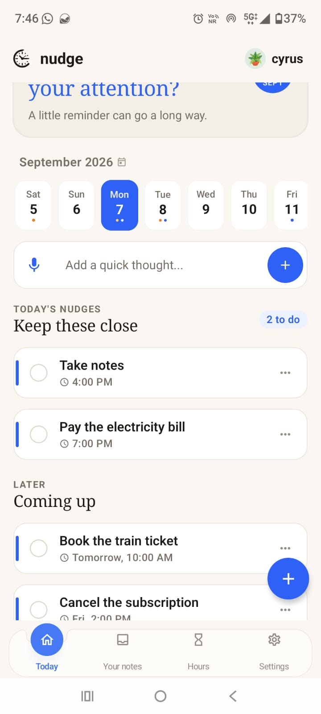
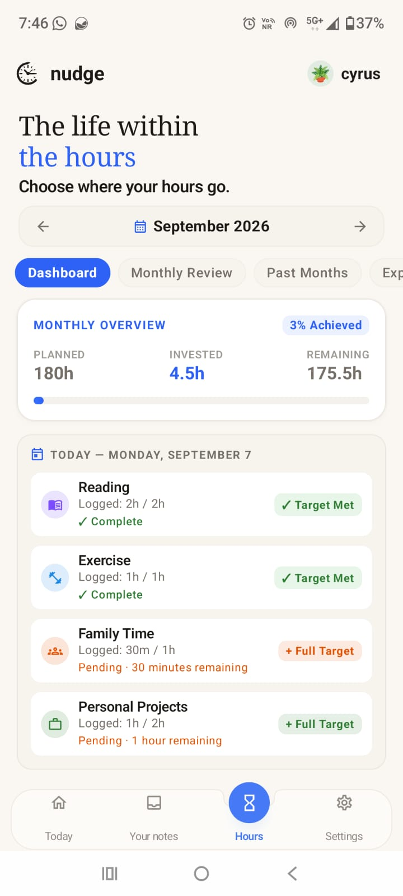
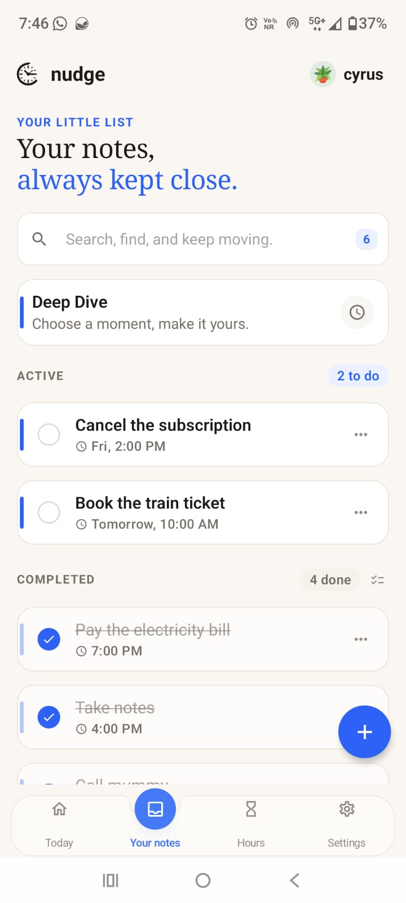
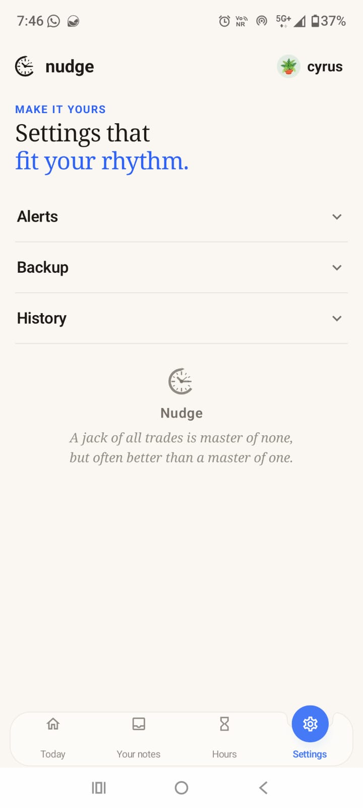
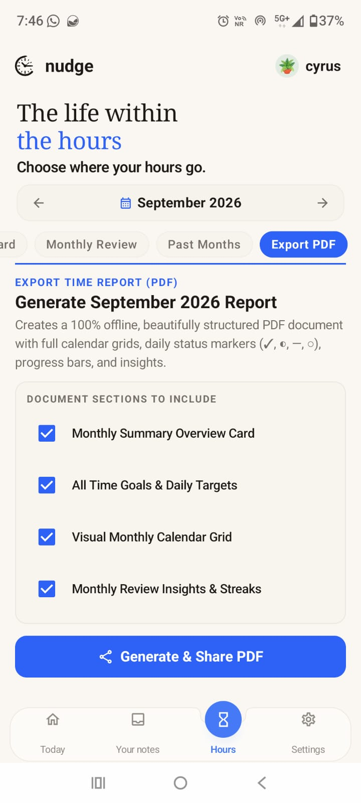
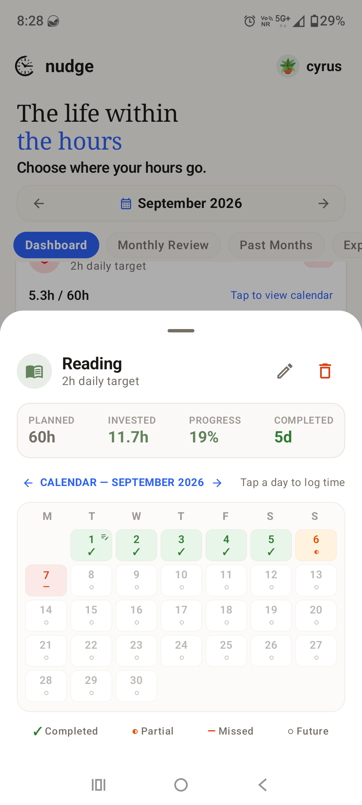

# Nudge

Nudge — a personal reminder and organization app designed to help you remember what matters.

## Nudge

**Nudge — Remember what matters.**

Nudge is a personal reminder and organization app designed to help you stay on top of the things that matter.

## ✨ Features

### 🔔 Reminders
Create reminders for important tasks, plans, or events and get notified at the right time.

### 📅 Calendar & Important Dates
Organize important dates, festivals, and observances with customizable reminder timings.

### 🌎 Event Reminders
Get automatic reminders for upcoming festivals, world days, and other important events.

### 📝 Notes
Quickly save ideas, information, plans, and things you want to remember in one place.

### ⏳ Track Your Hours
Record the time you spend on different activities and track your daily time investment.

### 🧠 Deep Dive
Start a focused session for 30 minutes, 1 hour, or a custom duration with a completion notification.

### 📊 Insights & Reports
Review your time, goals, and activity through monthly and historical insights.

### 📄 PDF Reports
Generate, download, and share PDF reports of your recorded information.

### 📥 Download History
Keep track of the reports you have previously downloaded.

### 💾 Backup & Restore
Back up your Nudge data and restore it whenever you need it.

## 📱 Screenshots

Here are some screenshots of Nudge and its features.

<table>
<tr>
<td></td>
<td></td>
<td></td>
</tr>
<tr>
<td></td>
<td></td>
<td></td>
</tr>
</table>

## 📥 Download Nudge

[⬇️ Download Nudge v1.0.0](./Nudge-v1.0.0.apk)

Nudge v1.0.0 is ready for everyday use.

---

**Nudge — Remember what matters.**
