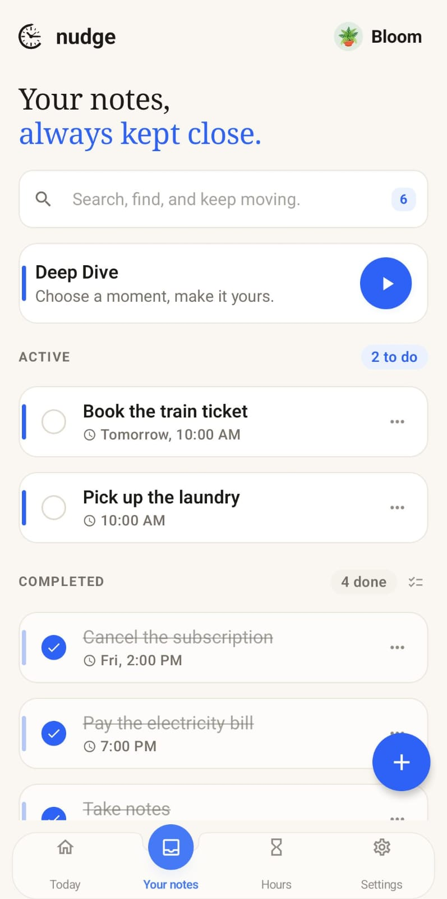
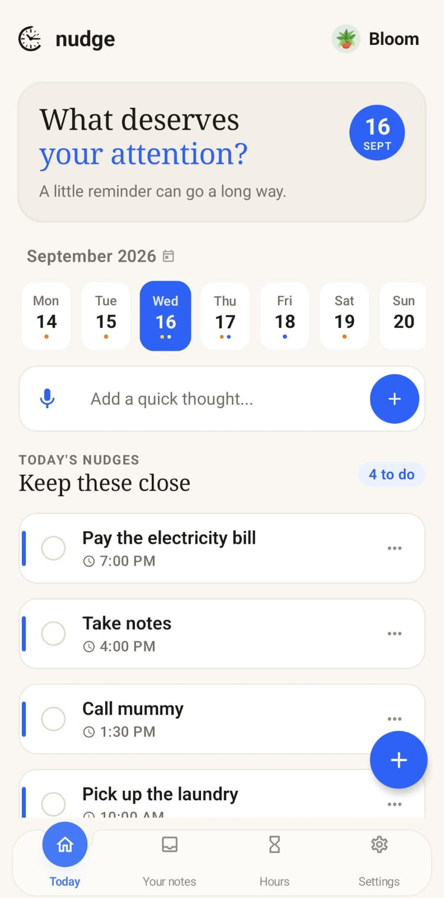
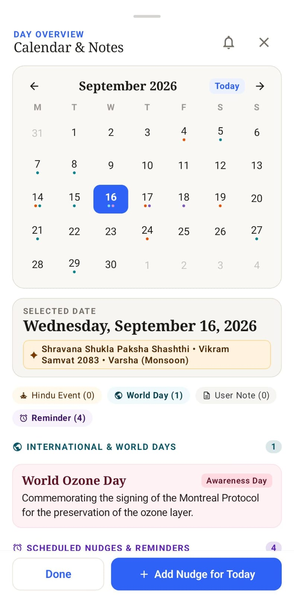
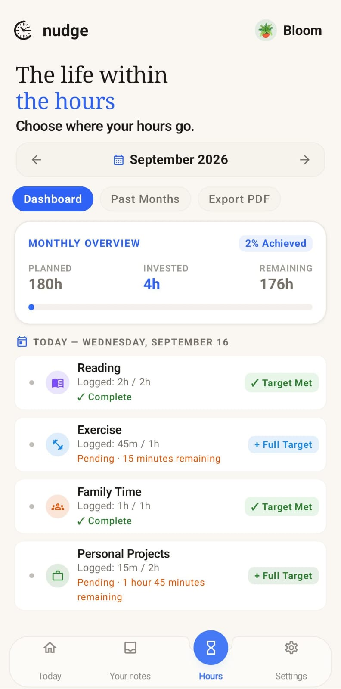
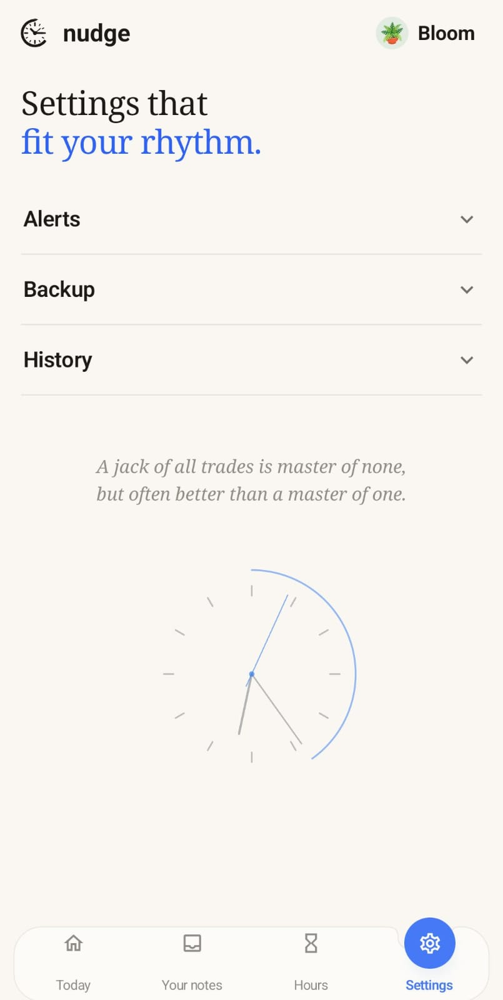
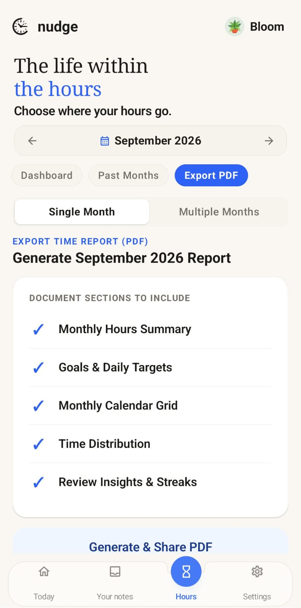

# 🧠 Nudge

> **Remember what matters.**

Nudge is a personal reminder, organization, and time-investment app designed to help you remember important things, organize your day, and understand where your time goes.

---

## 📱 Download Nudge

**[⬇️ Download Nudge v1.2.0](https://github.com/LuckyLogos/Nudge/releases/download/v1.2.0/Nudge.1.2.0.apk)**

**Version:** 1.2.0 · **Android APK** · **18.3 MB**

Nudge is ready for everyday use.

---

## ✨ Why Nudge?

Nudge brings reminders, important dates, notes, time tracking, focused sessions, reports, and data management together in one simple Android app.

It is designed around a simple idea:

> **Remember what matters — and understand how you spend your time.**

---

## 🚀 Features

| Feature | Description |
|---|---|
| 🔔 **Reminders** | Create reminders for important tasks, plans, and events with notifications at the right time. |
| 📅 **Calendar & Important Dates** | Organize important dates, festivals, and observances with customizable reminder timings. |
| 🌎 **Event Reminders** | Get automatic reminders for upcoming festivals, world days, and other important events. |
| 📝 **Notes** | Quickly save ideas, information, plans, and things you want to remember. |
| ⏱️ **Track Your Hours** | Record the time you spend on different activities and track your daily time investment. |
| 🧠 **Deep Dive** | Start focused sessions for a selected duration and receive a notification when the session is complete. |
| 📊 **Insights & Reports** | Review time goals, daily activity, progress, consistency, and historical insights. |
| 📄 **PDF Reports** | Generate detailed offline PDF reports of your recorded time and activity. |
| 💾 **Backup & Restore** | Create local backups and restore your Nudge data whenever needed. |
| 🛒 **Shopping History** | Keep track of previously recorded shopping information. |
| 🕘 **Nudge Clock Widget** | Keep your time visible with a simple and useful clock widget on your home screen. |
| 📅 **Reminder & Organizer** | Keep your important reminders and daily tasks organized in one place. |

---

## 📊 Insights & Reports

Nudge doesn't only remind you about things.

It also helps you understand your **time investment and progress** through:

- Monthly reports
- Multiple-month reports
- Visual calendars
- Progress tracking
- Consistency metrics
- Historical activity
- Time distribution
- PDF reports and sharing

---

## 📸 Screenshots

<table align="center">
  <tr>
    <td align="center">
      
    </td>
    <td align="center">
      
    </td>
  </tr>
  <tr>
    <td align="center">
      
    </td>
    <td align="center">
      
    </td>
  </tr>
  <tr>
    <td align="center">
      
    </td>
    <td align="center">
      
    </td>
  </tr>
</table>
---

## 🔐 Privacy

Nudge is designed with privacy in mind.

- Your reminders and notes stay on your device.
- Time tracking data is stored locally.
- PDF reports can be generated offline.
- Backup and restore are handled locally.
- No account is required to use the core app.

---

## 🛠️ Tech Stack

| Component | Technology |
|---|---|
| Language | Kotlin |
| UI | Jetpack Compose |
| Database | Room |
| Notifications | Android AlarmManager & NotificationManager |
| Architecture | Android native architecture |
| Reports | Offline PDF generation |
| Platform | Android |

---

## 🌱 What's Next?

Nudge is continuously being improved with new features, refinements, and usability improvements.

The goal remains simple:

> **Help you remember what matters and understand where your time goes.**

---

**Nudge — Remember what matters.**
