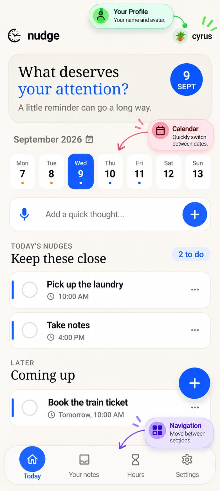
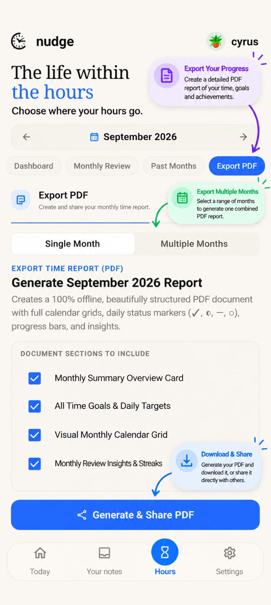
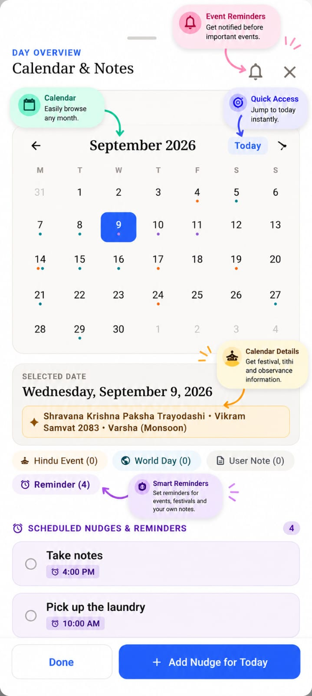
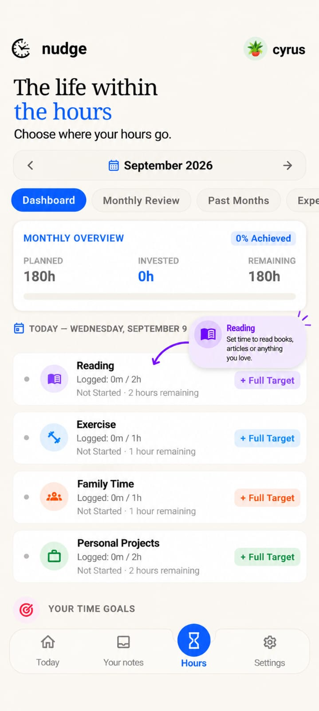
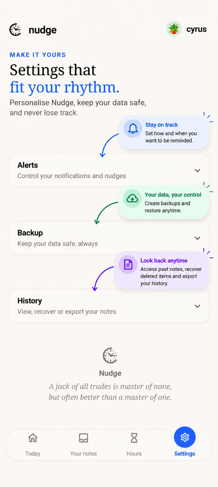
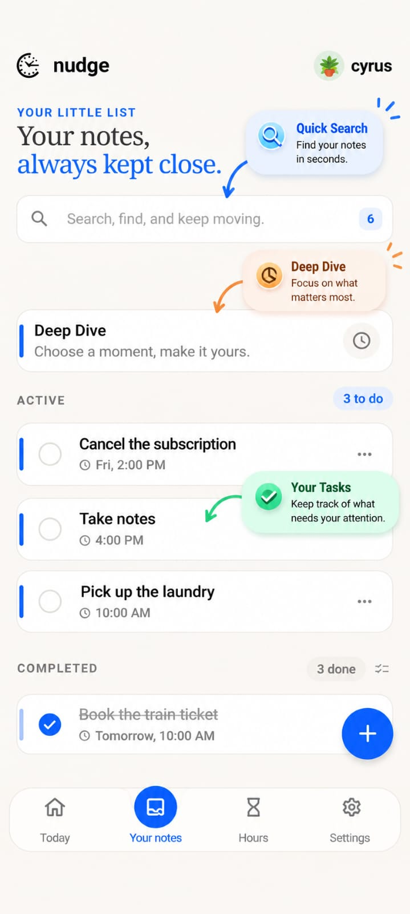

# Nudge

Nudge — a personal reminder and organization app designed to help you remember what matters.

## Nudge

**Nudge — Remember what matters.**

Nudge is a personal reminder and organization app designed to help you stay on top of the things that matter.

## ✨ Features

### 🔔 Reminders
Create reminders for important tasks, plans, and events, with notifications at the right time.

### 📅 Calendar & Important Dates
Organize important dates, festivals, and observances with customizable reminder timings.

### 🌍 Event Reminders
Get automatic reminders for upcoming festivals, world days, and other important events.

### 📝 Notes
Quickly save ideas, information, plans, and things you want to remember in one place.

### ⏱️ Track Your Hours
Record the time you spend on different activities and track your daily time investment.

### 🧠 Deep Dive
Start a focused session for a selected duration and receive a notification when your session is complete.

### 📊 Insights & Reports
Review your time goals, daily activity, progress, consistency, and historical insights.

### 📄 PDF Reports
Generate detailed, fully offline PDF reports for your recorded time and activity.
- Monthly reports
- Multiple-month reports
- Download and share reports
- Visual calendars, progress, and insights

### 🗑️ Recently Deleted
Recover deleted reminders within 30 days before they are permanently removed.

### 💾 Backup & Restore
Create a local backup of your Nudge data and restore it whenever you need it.
- Manual local backup
- Automatic backup
- Backup reminders
- Restore previous backups

### 📜 Export History
Keep track of PDF reports and other exports you have previously generated.

### 🕐 Nudge Clock Widget
Keep your time visible with a resizable and movable clock widget on your home screen.

### ↕️ Reorder & Organize
Reorder your time goals and daily entries to keep your workflow organized the way you want.

## 📱 Screenshots

Here are some screenshots of Nudge and its features.

<table>
<tr>
<td></td>
<td></td>
<td></td>
</tr>
<tr>
<td></td>
<td></td>
<td></td>
</tr>
</table>

## 📥 Download Nudge

[⬇️ Download Nudge v1.0.0](https://github.com/LuckyLogos/Nudge/releases/download/v1.0.0/Nudge.1.0.apk)

Nudge v1.0.0 is ready for everyday use.

---

**Nudge — Remember what matters.**
